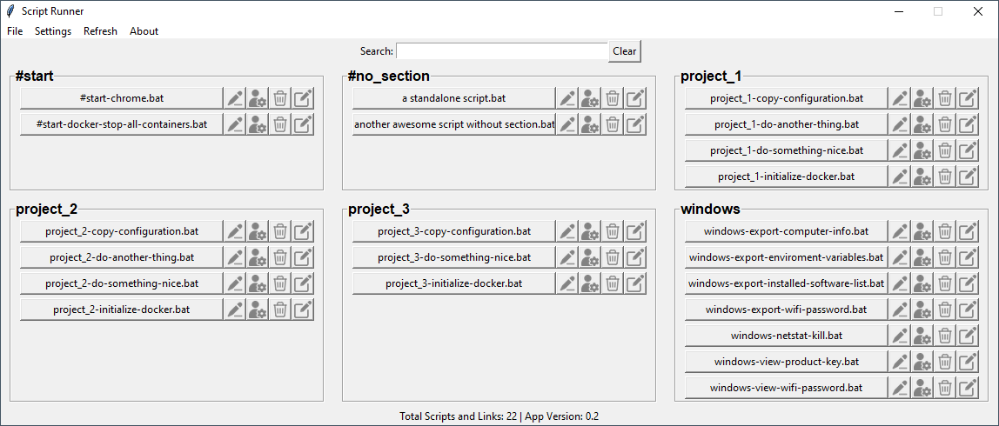

# Script Runner



Script Runner is a versatile graphical user interface (GUI) application developed in Python using Tkinter. It is designed to manage and run batch (.bat) files with ease, offering various features for script execution and organization.

## Features

1. **Run Batch Files**: Execute `.bat` files directly from the GUI, with options for normal or administrative execution.

2. **Script Management**: Create, edit, and organize your batch scripts within the application. Easily open the script directory in the file explorer.

3. **Customizable Settings**: Configure settings such as the scripts folder path and UI layout through a `config.cfg` file.

4. **Interactive UI Elements**: Utilize tooltips for better understanding of UI elements, along with confirmation message boxes and input dialogs.

5. **About Section**: Access information about the application version and the Python version it's running on.

6. **Error Handling and File Operations**: The application includes robust error handling and efficient file operations for a seamless user experience.

## Installation

1. Clone or download this repository to your local machine.

2. Ensure Python is installed on your system. Download Python from [Python Downloads](https://www.python.org/downloads/).

3. Install the required Python packages using pip:
   ```bash
   pip install tkinter Pillow
   ```

## Usage

Run the `script_runner.py` script to start the application, or use the compiled `.exe` file. Configure the `config.cfg` file as needed for your specific script directory and preferences.

Place all your scripts in a folder, and select that folder as the script directory. The text before the first hyphen "-" is used to get the section's name. Use the following naming convention to create sections: 

```
section_name-script_info
```

e.g.: If you have a script named `windows-view-wifi-password.bat`, a section called `windows` will be created automatically including this, and any other scripts that start with `windows`.

## A note from the developer

This program was entirely created using ChatGPT. Don't expect it to be perfect, don't expect it to be production grade software. Even this README, except of this paragraph, is maintained by ChatGPT. I'm not responsible for any data loss or anything negative that may happen while using this software.

All I wanted was a GUI to group and run batch scripts and shortcuts, and that's what I managed to get after long conversations with the AI.

## License

This project is licensed under the MIT License - see the LICENSE file for details.
